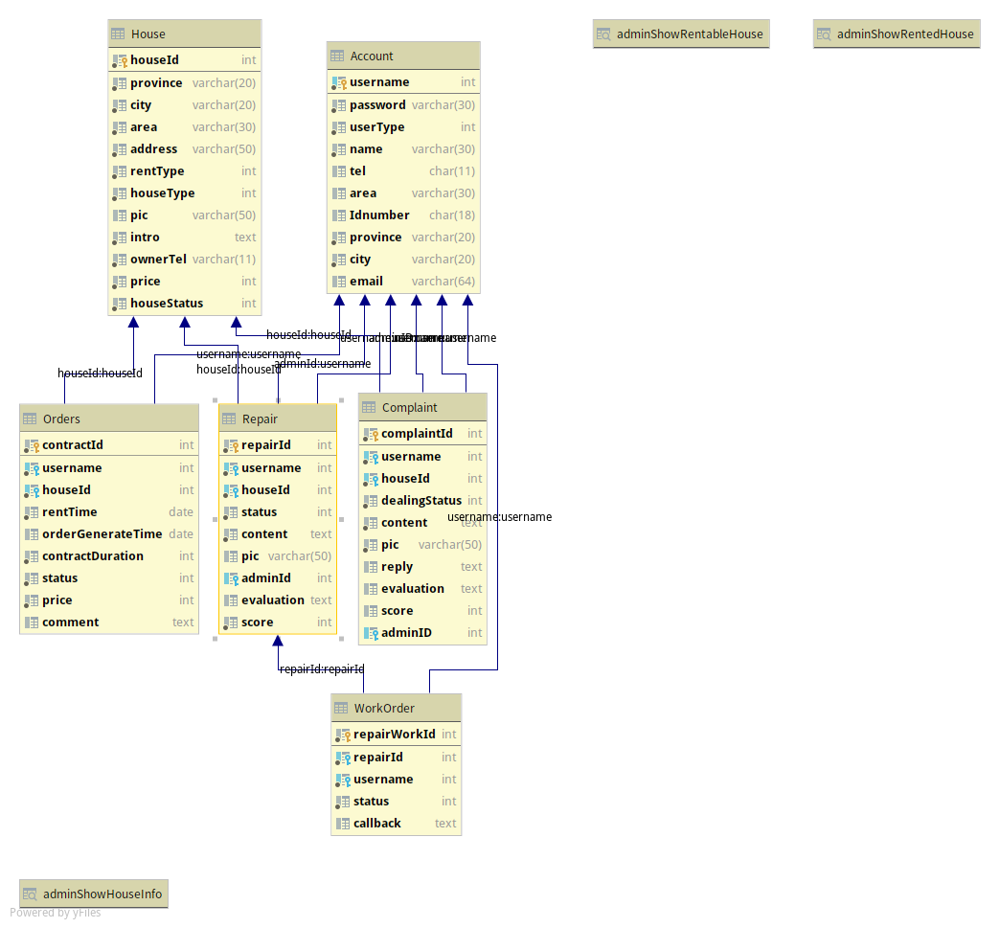

# 表以及存储过程以及视图介绍

| 日期 | 更新号 | 更新内容                   |
| ---- | ------ | -------------------------- |
| 5/22 | 001    | 初步建立表，没有增加约束   |
| 5/23 | 002    | 完成 tables 信息的初步更新 |
| 5/28 | 003    | 修改了表的数据             |
|      |        |                            |
|      |        |                            |
|      |        |                            |

### 表关系图

### tables

| 表名      | 中文名 |
| --------- | ------ |
| Account   | 帐号   |
| Repair    | 报修   |
| House     | 房源   |
| Order     | 订单   |
| Complaint | 投诉   |
| WorkOrder | 工单   |

### Account

| 序号 | 英文字段名 | 中文字段名 | 数据类型    | 是否允许为空 | 主键/外键 |
| ---- | ---------- | ---------- | ----------- | ------------ | --------- |
| 1    | username   | 用户名     | int         | 否           | 主键      |
| 2    | password   | 密码       | varchar(30) | 否           | /         |
| 3    | userType   | 权限       | int         | 否           | /         |
| 4    | name       | 用户昵称   | varchar(30) | 否           | /         |
| 5    | tel        | 电话       | char(11)    | 是           | /         |
| 6    | email      | 邮箱       | varchar(64) | 是           | /         |
| 7    | provicnce  | 省         | varchar(20) | 否           | /         |
| 8    | city       | 市         | varchar(20) | 否           | /         |
| 9    | area       | 地区       | varchar(64) | 否           | /         |
| 10   | Idnumber   | 身份证     | char(18)    | 是           | /         |

| authority | 权限  |
| --------- | ----- |
| 0         | root  |
| 1         | admin |
| 2         | user  |
| 3         | fixer |

### House	

| 序号 | 英文字段名  | 中文字段名 | 数据类型    | 是否允许为空 | 主键/外键 |
| ---- | ----------- | ---------- | ----------- | ------------ | --------- |
| 1    | houseId     | 房间编号   | int         | 否           | 主键      |
| 2    | province    | 省         | varchar(20) | 否           | /         |
| 3    | city        | 市         | varchar(20) | 否           | /         |
| 4    | area        | 地区       | varchar(30) | 否           | /         |
| 5    | address     | 具体地址   | varchar(50) | 否           | /         |
| 7    | rentType    | 租房形式   | int         | 否           | /8        |
| 8    | houseType   | 房间类型   | int         | 否           | /         |
| 9    | pic         | 图片       | varchar(50) | 是           | /         |
| 10   | intro       | 介绍       | text        | 是           | /         |
| 11   | ownerTel    | 户主电话   | varchar(11) | 否           | /         |
| 12   | price       | 价格       | int         | 否           | /         |
| 13   | houseStatus | 房源状态   | int         | 否           | /         |

| rentType | 类型     |
| -------- | -------- |
| 1        | 长租     |
| 0        | 短租     |
| 3        | 长短都可 |

| houseType | 类型   |
| --------- | ------ |
| 1         | 单人间 |
| 2         | 双人间 |
| 3         | 三人间 |
| 4         | 四人间 |

| Status | 租用状态 |
| ------ | -------- |
| 0      | 已租出   |
| 1      | 未租出   |
| -1     | 关闭     |

## ORDERs

| 序号 | 英文字段名        | 中文字段名       | 数据类型 | 是否允许为空 | 主键/外键 |
| ---- | ----------------- | ---------------- | -------- | ------------ | --------- |
| 1    | contractId        | 订单号           | int      | 否           | 主键      |
| 2    | username          | 用户名           | int      | 否           | 外键      |
| 3    | houseId           | 房源编号         | int      | 否           | 外键      |
| 4    | rentTime          | 租房时间         | date     | 否           | /         |
| 5    | orderGenerateTime | 订单生成时间状态 | date     | 否           | /         |
| 6    | contractDuration  | 订单持续时间     | int      | 否           | /         |
| 7    | status            | 订单状态         | int      | 否           | /         |
| 8    | price             | 订单价格         | int      | 否           | /         |
| 9    | comment           | 备注             | text     | 是           | /         |

| orderStatus | 状态           |
| ----------- | -------------- |
| 0           | 申请但未处理   |
| 1           | 同意           |
| 2           | 同意且开始生效 |
| -1          | 拒绝           |
| -2          | 保留异常号     |

### Complaint

| 序号 | 英文字段名    | 中文字段名 | 数据类型    | 是否允许为空 | 主键/外键 |
| ---- | ------------- | ---------- | ----------- | ------------ | --------- |
| 1    | complaintId   | 投诉编号   | int         | 否           | 主键      |
| 2    | username      | 用户名     | int         | 否           | 外键      |
| 3    | houseId       | 房源编号   | int         | 否           | 外键      |
| 4    | dealingStatus | 处理状态   | int         | 否           | /         |
| 5    | content       | 报修内容   | text        | 否           | /         |
| 6    | pic           | 图片       | varchar(50) | 否           | /         |
| 7    | reply         | 回复       | text        | 是           | /         |
| 8    | evaluation    | 评价       | text        | 是           | /         |
| 9    | score         | 打分       | int         | 是           | /         |
| 10   | adminId       | 客服用户名 | int         | 否           | 外键      |

 

| dealingStatus | 状态         |
| ------------- | ------------ |
| 0             | 申请但未处理 |
| 1             | 已处理未评价 |
| 2             | 已评价       |

### Repair

| 序号 | 英文字段名 | 中文字段名 | 数据类型    | 是否允许为空 | 主键/外键 |
| ---- | ---------- | ---------- | ----------- | ------------ | --------- |
| 1    | repairId   | 报修编号   | int         | 否           | 主键      |
| 2    | username   | 用户名     | int         | 否           | 外键      |
| 3    | houseId    | 房源编号   | int         | 否           | 外键      |
| 4    | status     | 处理状态   | int         | 否           | /         |
| 5    | content    | 报修内容   | text        | 否           | /         |
| 6    | pic        | 图片       | varchar(50) | 是           | /         |
| 7    | adminId    | 客服用户名 | int         | 是           | 外键      |
| 8    | evaluation | 评价       | text        | 是           | /         |
| 9    | score      | 打分       | int         | 否           | /         |

| dealingStatus | 状态         |
| ------------- | ------------ |
| 0             | 报修未被处理 |
| 1             | 报修被接受   |
| 2             | 修理完毕     |
| -1            | 报修被拒绝   |

### WorkOrder

| 序号 | 英文字段名   | 中文字段名 | 数据类型 | 是否允许为空 | 主键/外键 |
| ---- | ------------ | ---------- | -------- | ------------ | --------- |
| 1    | repairWorkId | 编号       | int      | 否           | 主键      |
| 2    | repairId     | 保修编号   | int      | 否           | 外键      |
| 3    | username     | 师傅用户名 | int      | 否           | 外键      |
| 4    | status       | 工单状态   | int      | 否           | /         |
| 5    | callback     | 维修反馈   | text     | 是           | /         |

| dealingStatus | 状态           |
| ------------- | -------------- |
| 0             | 工单未结束     |
| 1             | 工单正常结束   |
| -1            | 工单因异常终止 |

